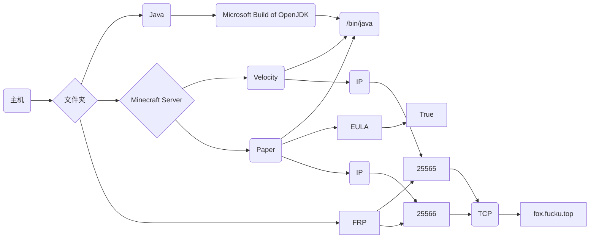

# Project Moonland X
该项目是FoxPixels的Minecraft多人生存服务器  
感谢玩家对**Project Moonland X**支持！
> ~~Moonland SMP~~ > Project Moonland X
## 游玩!
Java 26.1.2  
服务器地址 fox.fucku.top  
QQ群 515099384  
Webside <https://foxpixels.github.io/mc>
> Bedrock不在支持！
## 贡献者!
- FoxBells [[我是狐狸](https://space.bilibili.com/1030888043)]
- 1w235 [[_1w235_](https://space.bilibili.com/3494376449771615)]
- lower [[-来啦_](https://space.bilibili.com/1922397519)]
- hydez [[欢愉de张](https://space.bilibili.com/521478291)]
> 以后还会添加
## 结构图

> 写得不好...
## 彩蛋!
```html
<p>你是一只可爱的狐狸！</p>
```
